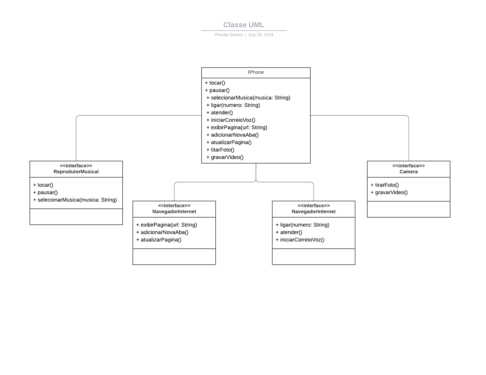

# Projeto Modelando o iPhone com UML: Funções de Músicas, Chamadas e Internet

## Descrição
Projeto co curso Desenvolvimento Java com IA - DIO
Este projeto simula as funcionalidades básicas de um iPhone, incluindo reprodutor musical, aparelho telefônico, navegador na internet e câmera. Ele foi desenvolvido em Java e implementa várias interfaces para representar essas funcionalidades, foi colocado uma funcionalidade a mais "Câmera".

## Funcionalidades
- **Reprodutor Musical**:
  - `tocar()`: Inicia a reprodução de música.
  - `pausar()`: Pausa a música em reprodução.
  - `selecionarMusica(String musica)`: Seleciona uma música específica para reprodução.

- **Aparelho Telefônico**:
  - `ligar(String numero)`: Realiza uma chamada para o número especificado.
  - `atender()`: Atende uma chamada recebida.
  - `iniciarCorreioVoz()`: Inicia o correio de voz.

- **Navegador na Internet**:
  - `exibirPagina(String url)`: Exibe a página da web especificada pela URL.
  - `adicionarNovaAba()`: Adiciona uma nova aba no navegador.
  - `atualizarPagina()`: Atualiza a página atual.

- **Câmera**:
  - `tirarFoto()`: Tira uma foto.
  - `gravarVideo()`: Grava um vídeo.

## Estrutura do Projeto
O projeto é composto pelas seguintes classes e interfaces:

- **Interfaces**:
  - `ReprodutorMusical`
  - `AparelhoTelefonico`
  - `NavegadorNaInternet`
  - `Camera`

- **Classe**:
  - `iPhone` (implementa todas as interfaces acima)

## Diagrama UML
<!-- !Diagrama UML
 -->


## Requisitos
- Java 8 ou superior

## Instalação
1. Clone o repositório:
   ```bash
   git clone https://github.com/seu-usuario/seu-repositorio.git

Feito com 💜 por PriscilaCS
